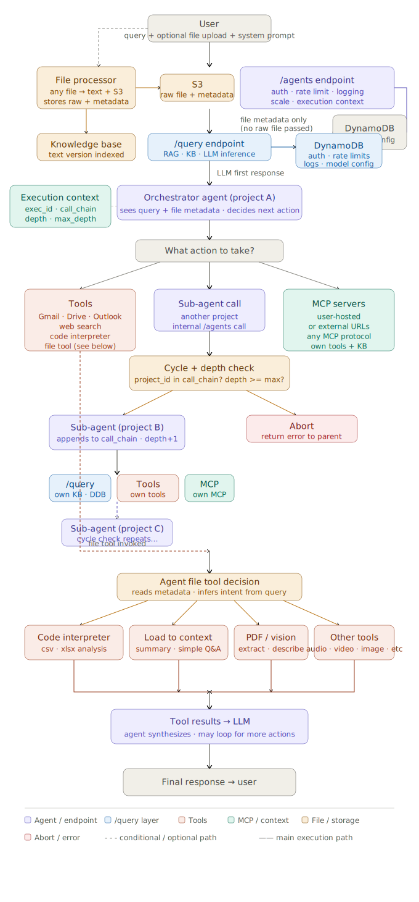

# agents
Everything is a tool, irrespective of whether it's a function, an API call, or a human interaction. The agent's job is to figure out which tool to use and when.
Main agent calls a tool which can be a tool, mcp, or another agent. Every sub agent can do the same thing. Max depth and cycles can be configured in config.json to prevent infinite loops.

## To run
add CREATEAI_API_KEY and CREATEAI_API_URL to .env file
```bash
CREATEAI_API_KEY=your_api_key
CREATEAI_API_URL=your_api_url
```

## Then run

```bash
python main.py
```

You can modify the config.json to change the workflow and the prompt can be added in main.py.

## Agent Architecture


